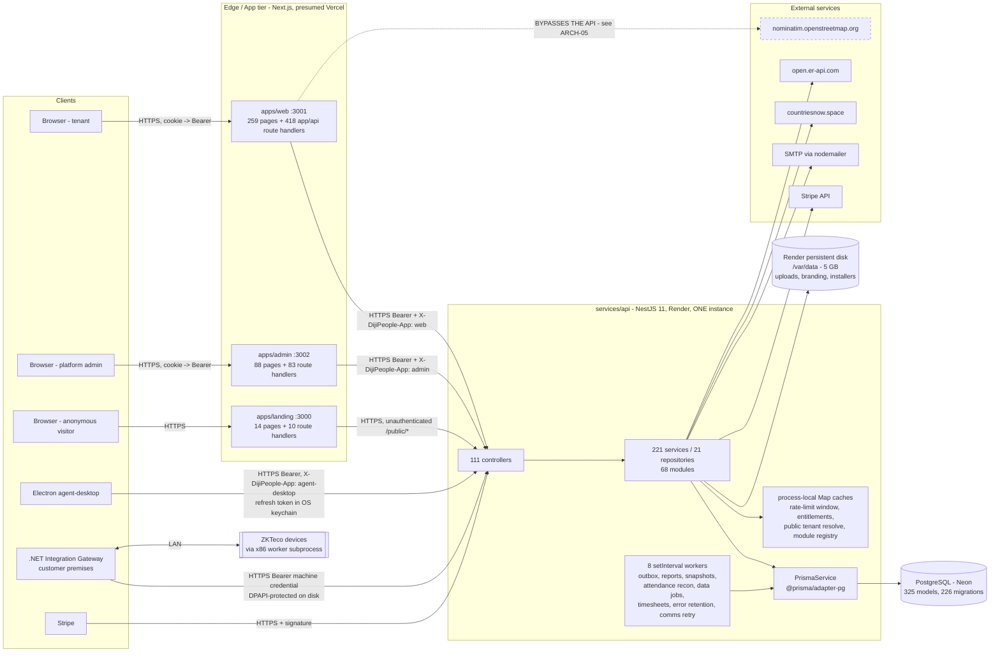

# ARCH — Architecture and System Topology

> **Auditor:** Architecture & System Topology specialist
> **Worktree:** `D:/My Work/hrm-dijipeople/dijipeople-audit` (branch `agent/full-technical-audit`)
> **Base commit:** `f55cf4b2`
> **Method:** static read of the tree, plus read-only execution of the repository's own
> invariant scripts (`check-proxies-*.mjs`) and three purpose-written read-only Node
> analysers (module import graph, Prisma model access map, tenant-less-model write map).
> No file in the audited tree was modified. No database was touched.

---

## 1. The map

### 1.1 Deployable and runtime components

| # | Component | Kind | Entry point | Deployed | Port / channel |
|---|---|---|---|---|---|
| 1 | `services/api` | NestJS 11 monolith | `services/api/src/main.ts:31` (`bootstrap()`), started by `start:prod` → `node dist/src/main.js` | **Render** web service `dijipeople-api`, plan `starter` (`render.yaml:1-8`) | `PORT` or 4000, global prefix `/api` |
| 2 | `apps/web` | Next.js 16 App Router | `apps/web/next.config.ts` + App Router | Not in-repo (presumed Vercel — `docs/deployment/environments.md:41`) | 3001 local |
| 3 | `apps/admin` | Next.js 16 App Router | `apps/admin/next.config.ts` | Not in-repo (presumed Vercel) | 3002 local |
| 4 | `apps/landing` | Next.js 16 App Router | `apps/landing/next.config.ts` | Not in-repo (presumed Vercel) | 3000 local |
| 5 | `apps/docs` | Next.js starter | `apps/docs/next.config.js` | Not deployed; effectively unused | 3003 local |
| 6 | `apps/agent-desktop` | Electron desktop app | `apps/agent-desktop/src/main/main.ts`, packaged `main: dist/main/main.js` (`package.json:8`) | NSIS installer published as an `ApplicationRelease` | outbound HTTPS only |
| 7 | `gateway/` | .NET on-premise Windows service **and** CLI in one exe | `gateway/src/DijiPeople.Gateway.Host/Program.cs:33` (`Main`); bare invocation = Windows service, any verb = admin CLI | Customer premises, installed by `gateway/packaging/install.ps1` | outbound HTTPS + LAN to devices |
| 8 | ZKTeco worker | x86 .NET child **process** spawned by the gateway | `tools/zkteco-poc/worker/Program.cs`; spawned at `Connectors/ZkTeco/ZkTecoWorkerClient.cs:77-103` (`ProcessStartInfo` / `new Process`) | With the gateway | stdio to parent, COM to device |
| 9 | `e2e` | Playwright harness | `e2e/playwright.config.ts` | CI only | — |
| 10 | `tools/zkteco-poc` (node CLI) | Proof of concept, explicitly "not wired into any production module" (`tools/zkteco-poc/package.json:5`) | `src/index.ts` | Never | — |

There are **no Dockerfiles and no `vercel.json`** anywhere in the tree
(`find . -iname "Dockerfile*"` and `find . -name vercel.json` both return nothing).
`render.yaml` is the only committed deployment descriptor, and it declares exactly
**one** service.

### 1.2 In-process background workers (there is no separate worker deployable)

All eight are `setInterval` loops inside the **API process**. There is no
`@nestjs/schedule`, no BullMQ, no Redis, no broker — `services/api/package.json`
dependencies contain none of them.

| Worker | File | Interval | Enable flag |
|---|---|---|---|
| Outbox dispatcher | `modules/outbox/outbox-worker.service.ts:53` | `OUTBOX_WORKER_POLL_INTERVAL_MS`, default 5 s | **`OUTBOX_WORKER_ENABLED`** |
| Report scheduler | `modules/reporting/schedule/report-scheduler.worker.ts:113` | 60 s default | **`REPORTS_SCHEDULER_ENABLED`** |
| Workforce snapshot | `modules/reporting/snapshot/workforce-snapshot.worker.ts:86` | configurable | **`REPORTS_WORKFORCE_SNAPSHOT_ENABLED`** |
| Attendance reconciliation queue | `modules/attendance-engine/attendance-reconciliation-queue.service.ts:56` | 30 s | *none* |
| Data job worker (import/export) | `modules/data-management/data-job-worker.service.ts:36` | 5 s | *none* |
| Timesheet scheduled jobs | `modules/timesheets/timesheet-jobs.service.ts:47` | 15 min | *none* |
| Error-log retention sweep | `modules/error-logs/error-logs.service.ts:62` | 24 h | *none* |
| Platform communications retry | `modules/platform-communications/platform-communications.service.ts:48` | 5 min | *none* |

### 1.3 Webhook receivers

- `POST /api/billing/stripe/webhook` — the real one. `@Public()`, raw-body parsed
  (`main.ts:150,163`), signature-verified (`modules/billing/controllers/stripe-webhook.controller.ts:49-90`).
- `POST /api/super-admin/billing/stripe/webhook` — a placeholder that returns
  `{ accepted: true, mode: 'placeholder' }` and does nothing. See **ARCH-11**.

No other inbound webhook receivers exist.

### 1.4 Authentication mechanisms at the API edge

Measured by `@UseGuards(...)` on controllers:

| Guard combination | Controllers | Who it authenticates |
|---|---|---|
| `JwtAuthGuard, PermissionsGuard` | 52 | tenant users (web) |
| `JwtAuthGuard, PermissionsGuard, EntitlementGuard` | 27 | tenant users + plan entitlement |
| `PublicRateLimitGuard` | 24 | anonymous |
| `JwtAuthGuard` alone | 20 | tenant users, no permission check at the controller |
| `JwtAuthGuard, RolesGuard, PlatformPermissionsGuard` | 4 | platform admins |
| `GatewayAuthGuard` | 3 | the .NET gateway's machine credential |
| `ReleasePublishTokenGuard` | 1 | CI/release machine token |
| `PartnerAuthGuard` | 1 | partner portal users |

`@Public()` appears on **40 handlers across 14 controllers**.

### 1.5 Dependency map



ASCII summary of the same thing:

```
Browser ─┬─► apps/web    ──┐
         ├─► apps/admin  ──┼─► services/api (NestJS, 1 instance) ─► Prisma ─► Neon Postgres
         └─► apps/landing──┘        │  │  │
                                    │  │  └─► /var/data (Render disk: uploads, installers)
agent-desktop ──────────────────────┤  └────► Stripe · SMTP · countriesnow.space · open.er-api.com
.NET gateway ───────────────────────┘
Stripe webhook ─────────────────────┘
apps/web ──► nominatim.openstreetmap.org        (the one edge that skips the API)

Cache tier: NONE. No Redis, no cache-manager, no broker.
            Only process-local Map instances inside the single API process.
```

### 1.6 Environment topology

| Environment | Exists | Evidence |
|---|---|---|
| LOCAL | yes | `packages/config/index.js:3-8` default ports |
| PRODUCTION | yes | `render.yaml`; Neon Postgres |
| STAGING / UAT / DEV | **no** | `docs/deployment/environments.md:14-17` — "Does not exist … no committed configuration" |

Promotion is local → production. See **ARCH-14**.

---

## 2. Findings

### ARCH-01 — Component inventory and topology are as documented; no undeclared deployable exists

- **Category:** Architecture / Inventory
- **Severity:** INFORMATIONAL
- **Confidence:** CONFIRMED
- **Known:** NEW
- **Component:** repository-wide
- **Evidence:**
  `render.yaml:1-5` — `services: - type: web / name: dijipeople-api / env: node / plan: starter`; it is the only service block in the file.
  `find . -iname "Dockerfile*" -not -path "*/node_modules/*"` → no results. `find . -name vercel.json` → no results.
  `services/api/package.json` dependency list contains no `redis`, `ioredis`, `bullmq`, `cache-manager`, `kafkajs` or `amqplib`.
  `services/api/src/modules/outbox/outbox-worker.service.ts:12-23` — "Deliberately a poll loop over a PostgreSQL table rather than a broker. This repository is a modular monolith with one database and no queue infrastructure".
- **Current behaviour:** One API process, three Next.js apps, one Electron client, one on-premise .NET service plus its x86 child process. No broker, no cache tier, no separate worker deployable.
- **Expected behaviour:** Same. The stated modular-monolith intent matches the artefacts.
- **Risk:** None. Recorded so later specialists do not hunt for components that do not exist.
- **Remediation:** None.
- **Difficulty:** LOW
- **Regression risk:** LOW
- **Fix now:** NO

---

### ARCH-02 — Tenant-guarded `/lookups` endpoints create, rename and deactivate **platform-global** geography rows shared by every tenant

- **Category:** Tenant Isolation / AuthZ
- **Severity:** HIGH
- **Confidence:** CONFIRMED
- **Known:** NEW
- **Component:** `services/api/src/modules/lookups`, `apps/web/app/api/lookups/**`
- **Evidence:**

  `services/api/prisma/schema.prisma:3864-3878` — `Country` has **no `tenantId`**:
  ```prisma
  model Country {
    id        String          @id @default(uuid())
    code      String          @unique
    name      String
  ```
  `StateProvince` (line 3880) and `City` are the same shape — global reference data.

  `services/api/src/modules/lookups/lookups.controller.ts:24-25` — the controller is on the **tenant** auth path, not the platform one:
  ```ts
  @Controller('lookups')
  @UseGuards(JwtAuthGuard, PermissionsGuard)
  ```

  `services/api/src/modules/lookups/lookups.controller.ts:96-114` — a tenant permission gates a global mutation:
  ```ts
  @Patch('states/:id')
  @Permissions('settings.update')
  @RequireAnyPermission(
    { entityKey: ENTITY_KEYS.SETTINGS, action: 'configure' },
    { entityKey: ENTITY_KEYS.TENANT_ADMINISTRATION, action: 'write' },
  )
  updateState(@Param('id') id: string, @Body() body: Record<string, unknown>) {
  ```
  The same pair guards `@Post('states')` (line 66), `@Delete('states/:id')` (106),
  `@Post('cities')` (127), `@Patch('cities/:id')` (157), `@Delete('cities/:id')` (167).

  `services/api/src/common/constants/permissions.ts:348-352` — `settings.update` is documented as a **tenant** permission:
  ```ts
  key: 'settings.update',
  name: 'Update settings',
  description: 'Update tenant configuration values and enabled feature flags.',
  ```
  and `permissions.ts:2186` grants the tenant `system-admin` role every non-customization key
  (`'system-admin': NON_CUSTOMIZATION_PERMISSION_KEYS`); `permissions.ts:2223` grants
  `'settings.update'` to the tenant **HR** role as well.

  `services/api/src/modules/lookups/lookups.service.ts:151-158` — no tenant scope, no platform check:
  ```ts
  async updateState(id: string, body: Record<string, unknown>) {
    const existing = await this.prisma.stateProvince.findFirst({ where: { id } });
    if (!existing) throw new NotFoundException('State / Province was not found.');
    const data = await this.readStateData(body, existing);
    return this.prisma.stateProvince.update({ where: { id }, data });
  }
  ```
  `lookups.service.ts:176-179` deletes the same way (`stateProvince.update({ where: { id }, data: { isActive: false } })`), and `lookups.service.ts:235` does it for `City`.

  Reachable end to end from the tenant product: `apps/web/app/api/lookups/states/[id]/route.ts:14-22` proxies `PATCH`, and `:24-31` proxies `DELETE`, to `/lookups/states/${id}`.

- **Current behaviour:** A user of tenant A holding `settings.update` plus `SETTINGS:configure`
  (the tenant System Admin holds both; HR holds the legacy key) can rename, create or deactivate a
  `StateProvince` / `City` row that every other tenant's employee records and address pickers use.
  Deactivation removes the row from every tenant's lists at once.
- **Expected behaviour:** Global reference data is platform-owned. These mutations belong behind
  `PlatformPermissionsGuard` on a `super-admin` / `platform-*` route, exactly as
  `AGENTS.md` states: "Cross-tenant … are only legitimate on the **platform** path
  (`authSubjectType: 'platform-user'`) … Never widen a tenant endpoint to serve platform needs."
- **Risk:** One tenant's HR or admin user silently corrupts reference data for all other tenants —
  a renamed or deactivated city breaks address selection and employee address display across the
  whole platform, with no cross-tenant audit trail and nothing in the UI warning the actor that the
  row is not theirs. It is also a denial-of-service primitive: deactivate the states a competitor
  tenant's workforce lives in.
- **Remediation:** Move `createState`/`updateState`/`deleteState`/`createCity`/`updateCity`/`deleteCity`
  out of `LookupsController` onto a platform-guarded controller (`SuperAdminController` or a new
  `PlatformGeographyController`) using `JwtAuthGuard, RolesGuard, PlatformPermissionsGuard`. Leave
  the `@Get` list/detail handlers on the tenant path. If tenants genuinely need to add local
  cities, add a tenant-owned `TenantCity` model rather than writing the global table.
- **Difficulty:** MEDIUM
- **Regression risk:** MEDIUM — the tenant settings screens under
  `/settings/regional/geography/*` currently call these and will need to move or lose their write controls.
- **Fix now:** YES

---

### ARCH-03 — `/lookups/*/usage` discloses employee counts across **all** tenants, and lets one tenant's data block another's delete

- **Category:** Tenant Isolation
- **Severity:** MEDIUM
- **Confidence:** CONFIRMED
- **Known:** NEW
- **Component:** `services/api/src/modules/lookups/lookups.service.ts`
- **Evidence:**
  `services/api/src/modules/lookups/lookups.service.ts:143-146` — `Employee` is a tenant-owned model, and this count has no `tenantId`:
  ```ts
  await usage(
    'Employee',
    this.prisma.employee.count({ where: { stateProvinceId: id } }),
  ),
  ```
  Same shape at `:108` (`countryId`), `:169`, `:211` and `:227-229` (`cityId`).
  Reachable from the tenant path at `lookups.controller.ts:46-53` (`@Get('countries/:id/usage')`, `@Permissions('settings.read')`).
  `lookups.service.ts:167-175` turns the cross-tenant count into a functional dependency:
  ```ts
  if (cityCount || employeeCount) {
    throw new ConflictException(
      'State / Province cannot be deleted because cities or employees reference it.',
    );
  }
  ```
- **Current behaviour:** `GET /api/lookups/states/:id/usage` returns the number of employees in
  that state **across every tenant on the platform**. A tenant admin can enumerate global
  workforce distribution by geography, one row at a time.
- **Expected behaviour:** Scope the count to `currentUser.tenantId`, or move the endpoint to the
  platform path together with the mutations in ARCH-02.
- **Risk:** Aggregate cross-tenant disclosure (not record-level). A tenant can infer where other
  DijiPeople customers employ people and roughly how many, which is commercially sensitive and is
  a tenant-isolation break by the repository's own rule ("Every query against a tenant-owned model
  **must** filter on `tenantId`").
- **Remediation:** Add `tenantId: currentUser.tenantId` to every `prisma.employee.count` in
  `lookups.service.ts` and thread `@CurrentUser()` into `getCountryUsage`, `getStateUsage`,
  `getCityUsage`, `deleteState`, `deleteCity` — or relocate them per ARCH-02.
- **Difficulty:** LOW
- **Regression risk:** LOW
- **Fix now:** YES

---

### ARCH-04 — No browser or client-side code anywhere under `apps/` reaches the database, and none reaches the API directly

- **Category:** Architecture / Data flow
- **Severity:** INFORMATIONAL
- **Confidence:** NOT OBSERVED (searched for specifically; absent)
- **Known:** NEW
- **Component:** `apps/web`, `apps/admin`, `apps/landing`, `apps/agent-desktop`
- **Evidence:**
  ```
  grep -rn "@prisma/client|from 'pg'|from \"pg\"|PrismaClient|@neondatabase|postgres://" \
       apps/ --include=*.ts --include=*.tsx --include=*.js --include=*.mjs --include=*.json
  → 0 matches
  grep -rn "DATABASE_URL" apps/ --include=*.ts --include=*.tsx --include=*.js --include=*.mjs
  → 0 matches
  ```
  No app `package.json` (`apps/web`, `apps/admin`, `apps/landing`, `apps/agent-desktop`) lists
  `pg`, `@prisma/client` or any database driver.
  Every file importing `getApiBaseUrl` / `NEXT_PUBLIC_API_*` is a route handler or a **server**
  component — `apps/web/app/components/workspace-switcher.tsx:1` opens `import { cookies } from "next/headers"`,
  and `apps/web/app/workspace/choose/page.tsx:1` likewise; neither carries `"use client"`.
  A scan of every `"use client"` file for `getApiBaseUrl` / `NEXT_PUBLIC_API` returned nothing,
  and `grep 'fetch("http' / 'fetch(`http'` across all `.tsx` in the three apps returned nothing.
- **Current behaviour:** The browser talks only to its own Next.js origin. The Next.js **server**
  attaches the auth cookie as a Bearer token and calls the API. The API is the only process that
  opens a Postgres connection at runtime.
- **Expected behaviour:** Exactly this.
- **Risk:** None.
- **Remediation:** None. Worth an invariant script so it stays true — `scripts/` already has the
  pattern (`check-no-hardcoded-urls.mjs`).
- **Difficulty:** LOW
- **Regression risk:** LOW
- **Fix now:** NO

> **One qualification, outside `apps/`:** the Playwright harness does open Postgres directly —
> `e2e/fixtures/environment.ts:1` `import { Client } from 'pg'` and `:125,192,220`
> `new Client({ connectionString: url })`, plus `e2e/tests/landing-checkout-provisioning.spec.ts:49`.
> That is test infrastructure asserting on provisioning side-effects, not product code, and `pg`
> is a **devDependency** of the `e2e` workspace only. The other non-API DB writers are the Prisma
> seed/backfill scripts under `services/api/prisma/` and `scripts/db-preflight.mjs`, all operator-run CLIs.

---

### ARCH-05 — The 511 Next.js route handlers are genuinely thin proxies, and four CI invariants hold them that way

- **Category:** Architecture / Layering
- **Severity:** INFORMATIONAL
- **Confidence:** CONFIRMED
- **Known:** KNOWN (BUG-0041, BUG-0039, BUG-0032 — the records that created the invariants)
- **Component:** `apps/web/app/api/**`, `apps/admin/app/api/**`, `apps/landing/app/api/**`
- **Evidence:**
  Counts: 511 `route.ts` files — web 418, admin 83, landing 10.
  All four repository invariants pass on this commit, executed read-only:
  ```
  check-proxies-decide-nothing:      511 route handler(s) decide nothing.        EXIT=0
  check-proxies-forward-refusals:    511 route handler(s) forward refusals.      EXIT=0
  check-proxies-forward-status:      517 handler file(s) forward the upstream status. EXIT=0
  check-proxy-forwards-client-ip:    25 proxy route handler(s) forward the visitor's address. EXIT=0
  ```
  `scripts/check-proxies-decide-nothing.mjs:66-72` — the allowlist is **empty**
  (`const ALLOWLIST = new Map();`) and a stale entry would fail the check, so nothing is exempted.
  Total handler size is 13,362 lines across 511 files (~26 lines each); the largest six are the
  auth handlers, which necessarily set cookies.
  I read **20** handlers in full — employees, payroll runs, benefits, billing portal sessions,
  documents, data-management imports, user roles (web and admin), currency usage, designations,
  team members, dashboard views, lookups states, attendance reverse-geocode, locations geocode,
  partner portal, landing leads, landing subscribe — and inspected a further **35** by targeted
  scan (every handler that does not import `server-api`, and every handler containing
  `.filter(`/`.map(`/`.reduce(`/`.sort(`). Representative shape
  (`apps/web/app/api/employees/route.ts:1-27`):
  ```ts
  const response = await apiRequest(`/employees${query ? `?${query}` : ""}`, { method: "GET" });
  return proxyApiJsonResponse(response);
  ```
  Auth is centralised, not per-handler: `apps/web/lib/server-api.ts:96-160` reads the cookie,
  sets `Authorization: Bearer`, sets `X-DijiPeople-App`, and de-duplicates refresh-on-401
  (`:305-325`). `apps/admin/lib/server-api.ts:27-60` is the admin equivalent.
- **Current behaviour:** Handlers forward path, query, body and status. Authorization is decided
  only by the API.
- **Expected behaviour:** Same.
- **Risk:** None.
- **Remediation:** None.
- **Difficulty:** LOW
- **Regression risk:** LOW
- **Fix now:** NO

---

### ARCH-06 — A handful of proxies reshape API payloads, which is contract logic living in the wrong tier

- **Category:** Architecture / Layering
- **Severity:** LOW
- **Confidence:** CONFIRMED
- **Known:** NEW (the *authorization* half of this is KNOWN — BUG-0041 — and is fixed)
- **Component:** `apps/web/app/api/**`
- **Evidence:**
  `apps/web/app/api/designations/route.ts:66-72` invents a field the API did not send:
  ```ts
  const next = { ...(record as Record<string, unknown>) };
  if (typeof next.code !== "string" && typeof next.level === "string") {
    next.code = next.level;
  }
  ```
  `apps/web/app/api/teams/[teamId]/members/route.ts:12-23` calls a *different* endpoint than its own
  path implies and synthesises the collection envelope:
  ```ts
  const team = await apiRequestJson<{ members?: TeamMemberRecord[] }>(`/teams/${teamId}`, { method: "GET" });
  return NextResponse.json({ records: (team.members ?? []).map(mapMember), totalRecords: team.members?.length ?? 0 });
  ```
  and `:63-75` derives `userName` from first/last/email.
  `apps/web/app/api/lookups/dashboard-views/route.ts:31-41` filters, maps and sorts the API's
  dashboard summary into picker options.
  `apps/web/app/api/partner/portal/[[...path]]/route.ts:22-27` makes one local decision — it
  returns `401 "Partner sign in is required."` when the partner cookie is absent, without calling
  the API.
- **Current behaviour:** ~10 handlers adapt shape (naming, envelopes, display-name assembly). None
  makes an authorization or monetary decision, which is why the invariant scripts pass — they
  detect only permission reads and named money assignments.
- **Expected behaviour:** Shape belongs to the API contract or to a client-side view model. A
  proxy that renames fields is a second, untested definition of the contract, and the partner
  handler's local 401 is a (fail-closed) authorization decision the API can neither see nor audit.
- **Risk:** Low and mostly maintenance: an API contract change that is correct upstream can be
  masked or mangled here, and the reshaping has no tests. The partner-portal 401 is fail-closed,
  so it cannot grant access it should not.
- **Remediation:** Move `normalizeDesignationRecord` and `mapMember` into
  `apps/web/lib/` view-model helpers called from the page, or fix the API contract
  (`GET /teams/:id/members` should exist). Let the partner handler forward to the API without a
  token and forward the API's 401.
- **Difficulty:** LOW
- **Regression risk:** MEDIUM — the consuming screens depend on the reshaped names.
- **Fix now:** LATER

---

### ARCH-07 — Two `apps/web` route handlers call a third-party geocoder directly, bypassing the API tier entirely

- **Category:** Architecture / Data flow · Privacy
- **Severity:** LOW
- **Confidence:** CONFIRMED
- **Known:** KNOWN in part (BUG-0041 removed the *client-IP leak* from this path; the tier bypass itself is not recorded)
- **Component:** `apps/web/app/api/attendance/reverse-geocode`, `apps/web/app/api/locations/geocode`, `apps/web/lib/location/geocoding.server.ts`
- **Evidence:**
  `apps/web/lib/location/geocoding.server.ts:14-15`:
  ```ts
  const NOMINATIM_ORIGIN = "https://nominatim.openstreetmap.org";
  const USER_AGENT = "DijiPeople/1.0 location-configuration";
  ```
  `apps/web/app/api/attendance/reverse-geocode/route.ts:33-34` — an attendance punch's coordinates
  go from the Next tier to OpenStreetMap:
  ```ts
  const suggestion = await reverseGeocode(latitude, longitude);
  return NextResponse.json({ addressText: suggestion?.label ?? null });
  ```
  `apps/web/app/api/locations/geocode/route.ts:16-25` is the same for forward search.
  Neither call passes an `AbortSignal` or timeout — `grep -n "AbortSignal|timeout|signal" apps/web/lib/location/geocoding.server.ts` → 0 matches.
- **Current behaviour:** These are the only route handlers in the tree that reach an origin other
  than the DijiPeople API. Employee punch coordinates are sent to a public third party from the
  Next.js server, outside the API's audit, rate limiting and tenant settings.
- **Expected behaviour:** If geocoding is a product capability it belongs in the API, where the
  call can be audited, cached in Postgres, rate limited per tenant and switched off by a tenant
  setting. BUG-0041 already established that this handler's helper "exists so the *API* can see the
  visitor's address" — the tier boundary is the same argument.
- **Risk:** Coordinate data (which for the attendance route is an identified employee's location at
  a known time) leaves the platform to a service with no contract. The un-timed `fetch` also means
  a hung Nominatim stalls a Next.js server route until undici's default header timeout.
- **Remediation:** Add `GET /api/locations/geocode` to the API (a small service in `lookups` or
  `organization`), give it a timeout and a Postgres-backed cache, and reduce these two handlers to
  ordinary proxies. Minimum interim fix: `AbortSignal.timeout(...)` in `geocoding.server.ts`.
- **Difficulty:** MEDIUM
- **Regression risk:** LOW
- **Fix now:** LATER

---

### ARCH-08 — The API's module boundary is nominal: 152 of 310 Prisma models are queried directly from more than one module

- **Category:** Architecture / Module boundaries
- **Severity:** MEDIUM
- **Confidence:** CONFIRMED
- **Known:** NEW (the *rule* is recorded — `docs/knowledge/architecture/system-architecture.md:54`, `AGENTS.md` principle 3 — but no record tracks the violation)
- **Component:** `services/api/src/modules/**`
- **Evidence:**

  Measured by scanning every non-spec `.ts` under `services/api/src/modules` for
  `prisma.<model>.<operation>`:
  ```
  DISTINCT PRISMA MODELS ACCESSED FROM modules/: 310
  MODELS ACCESSED FROM >1 MODULE:                152   (49%)
  TOTAL PRISMA CALL SITES:                     3,498
  ```
  The worst offenders, with per-module call-site counts:
  ```
  employee : 36 modules  [dashboard:22, employees:20, attendance-integrations:13,
                          attendance-engine:10, onboarding:9, organization:6, payroll:6, …]
  user     : 26 modules  [tenant-control-plane:15, users:15, super-admin:12, auth:6, …]
  tenant   : 20 modules  [super-admin:25, tenants:12, tenant-control-plane:11, billing:10, …]
  businessUnit : 19 · department : 16 · organization : 14 · leaveRequest : 14 · attendanceEntry : 12
  ```
  `dashboard` touches the `employee` table **more times than the `employees` module does**
  (22 vs 20) while importing nothing from it — `services/api/src/modules/dashboard/dashboard.module.ts:15`:
  ```ts
  imports: [JwtModule.register({}), AttendanceModule],
  ```
  and `dashboard.service.ts:261-281` runs `employee.count` / `employee.groupBy` on its own.

  Alongside that, **37 cross-module imports of another module's repository** — the explicit thing
  `AGENTS.md` forbids ("Cross-module needs are satisfied by injecting the owning module's service,
  not by re-querying its tables"). 30 are in services, 7 in `*.module.ts` provider lists:
  ```
  employees/employees.service.ts:36,38,39  → organization/, roles/, users/ repositories
  leave/leave.service.ts:36,37             → employees/, users/ repositories
  onboarding/onboarding.service.ts:14,15,17→ organization/, recruitment/, users/ repositories
  payroll/payroll.service.ts:21            → employees/employees.repository
  timesheets/timesheets.service.ts:20      → employees/employees.repository
  tenants/tenants.service.ts:26,28,29      → super-admin/plans.repository, roles/, users/
  super-admin/*.service.ts (×7)            → leads/, roles/, tenants/, users/ repositories
  teams, projects, attendance, attendance-engine, auth, users, workflows, tenant-control-plane (1–2 each)
  ```

  The concrete consequence is duplicated business rules. `Employee` is soft-deleted, and the rule
  is re-implemented per module rather than owned once:
  `employees/employees.repository.ts:243` — `{ id: employeeId, tenantId, isDeleted: false, deletedAt: null }`
  `dashboard/dashboard.service.ts:2260-2269` — a *second* copy of the same rule:
  ```ts
  private employeeBaseWhere(currentUser, where = {}) {
    return { tenantId: currentUser.tenantId, isDeleted: false, deletedAt: null, ...where };
  }
  ```
  Eleven files query `prisma.employee` and never mention `isDeleted` at all —
  `lookups.service.ts` (5 queries), `loans.service.ts` (5), `payslips.service.ts` (3),
  `payroll/payroll-run.service.ts` (3), `notifications.service.ts` (3), `agent/agent.service.ts` (3),
  `attendance-integrations/mapping/employee-mapping.service.ts` (3),
  `claims.service.ts` (2), `business-trips.service.ts` (2), `workflows/workflow-runtime.service.ts` (2),
  `attendance-integrations/work-sites/employee-work-site-resolver.service.ts` (2).

- **Current behaviour:** `PrismaService` is a single global provider injected into ~68 modules, so
  every module can and does read and write every table. Ownership is a naming convention only;
  nothing structural enforces it.
- **Expected behaviour:** Per `AGENTS.md`: reach another domain through its exported service.
- **Risk:** This is the amplifier behind the audit's central premise. Tenant isolation is enforced
  by hand at 3,498 call sites instead of at ~21 repositories; a soft-delete, access-scope or audit
  rule added to an owning repository is silently not applied by the other 35 modules reading the
  same table; and any change to a "private" model's semantics has an unbounded blast radius.
- **Remediation:** Not a rewrite. Three bounded steps: (1) a `scripts/check-module-boundaries.mjs`
  invariant that fails on a new cross-module `*.repository` import, with the existing 37 as a
  dated, shrinking allowlist; (2) for the three hottest tables (`employee`, `user`, `tenant`),
  route foreign reads through the owning repository — `EmployeesRepository` already exposes
  tenant-scoped finders like `findByUserIdAndTenant`; (3) audit the eleven files above for
  soft-delete correctness (some are legitimately meant to see deleted rows; each should say so).
- **Difficulty:** HIGH
- **Regression risk:** MEDIUM
- **Fix now:** NO — but step (1) is cheap and stops the growth.

---

### ARCH-09 — Circular module dependencies: 10 mutual pairs and one 18-module strongly-connected component

- **Category:** Architecture / Module boundaries
- **Severity:** MEDIUM
- **Confidence:** CONFIRMED
- **Known:** NEW
- **Component:** `services/api/src/modules/**`
- **Evidence:**
  Directed graph built from every non-type-only relative import that crosses a module directory
  (554 edges). Mutual pairs:
  ```
  attendance <-> attendance-engine        leads <-> partner-experience
  billing <-> super-admin                 leads <-> super-admin
  documents <-> tenant-settings           notifications <-> workflows
  platform-runtime <-> super-admin        super-admin <-> tenant-control-plane
  super-admin <-> tenants                 tenant-settings <-> tenants
  ```
  Tarjan on the same graph yields one SCC of **18 modules**:
  ```
  auth, billing, contracts, customization, documents, leads, notifications,
  partner-experience, platform-communications, platform-runtime, super-admin,
  support-cases, tenant-control-plane, tenant-settings, tenants, users, views, workflows
  ```
  plus a second of size 2 (`attendance`, `attendance-engine`).

  Only **6** of the 10 mutual pairs are acknowledged with `forwardRef` at the Nest level —
  `attendance ↔ attendance-engine`, `documents ↔ tenant-settings`, `notifications ↔ workflows`
  (`attendance.module.ts`, `attendance-engine.module.ts`, `documents.module.ts`,
  `notifications.module.ts`, `tenant-settings.module.ts`, `workflows.module.ts`). The remaining
  four (`billing ↔ super-admin`, `leads ↔ partner-experience`, `leads ↔ super-admin`,
  `platform-runtime ↔ super-admin`, `super-admin ↔ tenant-control-plane`, `super-admin ↔ tenants`)
  avoid a Nest cycle only because one side reaches across by importing a **class file** rather
  than importing the module — e.g. `tenants/tenants.module.ts:8-9`:
  ```ts
  import { BillingService } from '../super-admin/billing.service';
  import { PlansRepository } from '../super-admin/plans.repository';
  ```
  which is ARCH-10's mechanism.

  `super-admin` is the hub: it depends on 19 modules and is depended on by 6.
  Most-depended-on modules overall: `audit` (43 importers), `tenant-settings` (18),
  `notifications` (16), `platform-auth` (15), `auth` (12).
- **Current behaviour:** The commercial/tenancy half of the API is one mutually recursive cluster.
  It boots — `forwardRef` and file-level imports both work — but the cluster cannot be reasoned
  about, tested or extracted a module at a time.
- **Expected behaviour:** A directed acyclic module graph, with `forwardRef` reserved for the rare
  genuinely bidirectional pair and each one carrying its justification (the three that do are
  commented, e.g. `tenant-settings/branding-assets.service.ts:114`).
- **Risk:** Provider-initialisation order becomes load-bearing and undeclared; a `forwardRef` that
  should exist and does not surfaces as a runtime `Nest can't resolve dependencies` only once a
  particular import path is added; and unit-testing any member of the 18 requires standing up most
  of the cluster.
- **Remediation:** Break the two highest-value edges first. `tenants → super-admin` exists only for
  `PlansRepository` and `BillingService`; a small `PlanCatalogModule` owning `Plan`/`PlanPrice` and
  exported to both removes `tenants ↔ super-admin` and `billing ↔ super-admin` together. Then add
  the boundary invariant from ARCH-08 with cycle detection so the SCC cannot grow.
- **Difficulty:** HIGH
- **Regression risk:** MEDIUM
- **Fix now:** NO

---

### ARCH-10 — Thirteen providers are re-declared inside foreign modules, creating a second instance in a separate injector

- **Category:** Architecture / DI
- **Severity:** LOW
- **Confidence:** CONFIRMED
- **Known:** NEW
- **Component:** `services/api/src/modules/**/*.module.ts`
- **Evidence:**
  ```
  tenants        re-provides UsersRepository (owned by users)            [tenants/tenants.module.ts]
  tenants        re-provides RolesRepository (owned by roles)            [tenants/tenants.module.ts]
  tenants        re-provides PlansRepository (owned by super-admin)      [tenants/tenants.module.ts]
  tenants        re-provides BillingService  (owned by super-admin)      [tenants/tenants.module.ts]
  super-admin    re-provides TenantsRepository (owned by tenants)        [super-admin/super-admin.module.ts]
  super-admin    re-provides LeadsRepository   (owned by leads)          [super-admin/super-admin.module.ts]
  tenant-settings re-provides PublicTenantCacheService (owned by tenants)[tenant-settings/tenant-settings.module.ts]
  employees / users re-provide RolesRepository (owned by roles)
  reports        re-provides ReportScopeResolver (owned by reporting)
  demo-data / leads / super-admin re-provide PlatformPermissionsGuard (owned by platform-auth)
  ```
  `services/api/src/modules/tenants/tenants.module.ts:19-38` — `TenantsModule` imports
  `PermissionsModule`, `AuditModule`, `TenantSettingsModule`, but lists `UsersRepository`,
  `RolesRepository`, `PlansRepository` and `BillingService` in its **own** `providers` array rather
  than importing `UsersModule`, `RolesModule` or `SuperAdminModule`.

  The clearest symptom is `PublicTenantCacheService`, whose store is `static` **because** of this —
  `services/api/src/modules/tenants/public-tenant-cache.service.ts:11`:
  ```ts
  private static readonly sharedCache = new Map<string, CacheEntry<unknown>>();
  ```
  Two Nest instances exist (one in `TenantsModule`, one in `TenantSettingsModule`); the `static`
  keyword is the only thing that keeps `deleteByPrefix` from invalidating just half the cache.
- **Current behaviour:** Nest instantiates a distinct object per declaring module. Today no harm is
  observed: the repositories are stateless, and the one cache defends itself with `static`.
- **Expected behaviour:** Import the owning module and consume its exported provider. `TenantsModule`
  already exports `TenantsRepository`, so the pattern exists.
- **Risk:** Latent. Any state, memoisation, `OnModuleInit` hook or `setInterval` added to one of
  these providers silently runs or caches twice, and the second copy is invisible at the call site.
  It is also the mechanism that hides four of ARCH-09's cycles from Nest's own cycle detection.
- **Remediation:** Replace the foreign entries in each `providers` array with an `imports` entry
  for the owning module, adding `exports` where needed. `PlatformPermissionsGuard` is stateless
  and could simply move to a shared `PlatformAuthModule` export.
- **Difficulty:** MEDIUM
- **Regression risk:** MEDIUM — resolving these will surface the ARCH-09 cycles and may need `forwardRef`.
- **Fix now:** LATER

---

### ARCH-11 — Five of eight background workers start unconditionally in every process, including CLI seeds and tests

- **Category:** Architecture / Operations
- **Severity:** LOW
- **Confidence:** CONFIRMED
- **Known:** NEW
- **Component:** `services/api/src/modules/**`
- **Evidence:**
  The three that gate themselves state exactly why —
  `modules/outbox/outbox-worker.service.ts:24-28`:
  > "Off by default. A worker that starts itself in every process — including tests, CLI seeds and
  > one-off scripts — is how a background loop ends up running somewhere nobody expected, so
  > enabling it is an explicit deployment decision via `OUTBOX_WORKER_ENABLED`."

  The five that do not, all in `onModuleInit` with no flag:
  ```
  modules/attendance-engine/attendance-reconciliation-queue.service.ts:56
    this.timer = setInterval(() => void this.drain(), POLL_INTERVAL_MS);        // 30 s
  modules/data-management/data-job-worker.service.ts:36
    this.timer = setInterval(() => void this.runCycle(), POLL_INTERVAL_MS);     // 5 s
  modules/timesheets/timesheet-jobs.service.ts:47
    this.timer = setInterval(() => void this.runScheduledCycle(), 15 * 60 * 1000);
  modules/error-logs/error-logs.service.ts:62
    this.retentionTimer = setInterval(() => void this.cleanupExpiredLogs(), 24*60*60*1000);
  modules/platform-communications/platform-communications.service.ts:48
    this.retryTimer = setInterval(() => void this.runRetryCycle(), 5 * 60_000);
  ```
  All five call `.unref?.()`, so they do not hold a CLI process open — but a long-running seed or
  an e2e run that keeps the container alive past one tick will execute them against whatever
  database is configured.
- **Current behaviour:** Loading the Nest container for any purpose starts five recurring
  database-mutating loops. `DataJobWorkerService` runs import/export jobs; `TimesheetJobsService`
  generates and closes timesheets; `PlatformCommunicationsService` retries outbound email.
- **Expected behaviour:** The `OUTBOX_WORKER_ENABLED` convention applied consistently, so which
  process drains which queue is a deployment decision rather than a side effect of instantiation.
- **Risk:** Low today — the API is single-instance (ARCH-12) and CLIs are short-lived. It becomes
  real the moment a second instance, a worker service or a long-lived test container exists:
  duplicate email retries and duplicate timesheet generation. The claim/`updateMany` patterns in
  `data-job-worker.service.ts:80-88` and the reconciliation queue's partial unique index do make
  concurrent drains safe, which limits the blast radius to wasted work.
- **Remediation:** Give each of the five an `isEnabled()` reading a per-worker env flag defaulting
  to **on** for the API service and **off** when `process.env.DIJIPEOPLE_CLI === 'true'` — or
  simply follow the outbox pattern and declare the flags in `render.yaml` alongside
  `OUTBOX_WORKER_ENABLED`.
- **Difficulty:** LOW
- **Regression risk:** LOW
- **Fix now:** LATER

---

### ARCH-12 — The API is architecturally pinned to a single instance, and several correctness mechanisms depend on that without saying so

- **Category:** Architecture / Scalability
- **Severity:** MEDIUM
- **Confidence:** CONFIRMED
- **Known:** KNOWN in part — `render.yaml` documents the disk tradeoff explicitly; the process-local state that also depends on it is not recorded
- **Component:** `services/api`, `render.yaml`
- **Evidence:**
  `render.yaml` (disk block comment) states the constraint for files:
  > "**TRADEOFF:** a Render disk pins this service to a SINGLE INSTANCE — it cannot be attached to
  > a horizontally scaled service. `starter` runs one instance, so this is free today; if the API
  > ever needs to scale out, file storage must move to object storage."

  What is *not* recorded is that correctness state is also process-local:
  `services/api/src/common/guards/public-rate-limit.guard.ts:10` — the rate limiter that
  BUG-0013 / BUG-0031 / BUG-0033 / BUG-0075 exist to provide is an in-memory `Map`:
  ```ts
  const windows = new Map<string, { count: number; resetsAt: number }>();
  ```
  `services/api/src/common/security/tenant-entitlement.service.ts:82` — plan entitlements are
  cached per instance: `private readonly cache = new Map<string, CacheEntry>();`
  `services/api/src/modules/tenants/public-tenant-cache.service.ts:11` — tenant resolution cache.
  `services/api/src/modules/data-management/module-registry.service.ts:205` — module descriptor cache.
  No Redis or shared cache exists anywhere (`services/api/package.json` has no cache dependency).
  `StorageService` writes to the local filesystem — `common/storage/storage.service.ts:19-21,40`
  (`FILE_STORAGE_DIR`, `writeFile`).
- **Current behaviour:** One instance, so all of the above is correct. Every credential rate-limit
  window also resets on each deploy, since the `Map` is process memory.
- **Expected behaviour:** Either the single-instance constraint is stated as a system invariant in
  one place that lists *everything* depending on it, or the dependencies are removed.
- **Risk:** The failure mode is silent and security-relevant. Scaling to two instances multiplies
  every public rate limit by the instance count (BUG-0033's desktop-agent login enumeration comes
  straight back), serves stale entitlements from whichever instance has not invalidated, and makes
  uploaded documents visible from only one instance. Nothing in the code fails or warns.
- **Remediation:** Add the constraint to `docs/deployment/environments.md` and to
  `scripts/check-production-advisories.mjs` as a named advisory listing the four process-local
  caches, the rate limiter and the disk. Before any scale-out: move rate limiting to a Postgres
  table or Redis, move `FILE_STORAGE_DIR` to object storage, and make entitlement invalidation
  event-driven through the existing outbox.
- **Difficulty:** MEDIUM (documenting: LOW)
- **Regression risk:** LOW
- **Fix now:** LATER — document now, re-engineer before scaling.

---

### ARCH-13 — A second, dead Stripe webhook endpoint returns `{ accepted: true }` and does nothing

- **Category:** Architecture / Dead code
- **Severity:** LOW
- **Confidence:** CONFIRMED
- **Known:** NEW (adjacent to BUG-0989, BUG-1128, ITEM-0094, all about the *real* webhook)
- **Component:** `services/api/src/modules/super-admin`
- **Evidence:**
  `services/api/src/modules/super-admin/super-admin.controller.ts:732-735`:
  ```ts
  @Post('billing/stripe/webhook')
  handleStripeWebhook() {
    return this.superAdminService.handleStripeWebhook();
  }
  ```
  → `super-admin.service.ts:3378-3380` → `super-admin/billing.service.ts:462-468`:
  ```ts
  async handleStripeWebhook() {
    return { accepted: true, provider: 'stripe', mode: 'placeholder' };
  }
  ```
  The real receiver is `modules/billing/controllers/stripe-webhook.controller.ts:15,48-90`
  (`@Controller('billing/stripe')`, `@Public()`, signature verification), and it is the only path
  `main.ts:150,163` configures raw-body parsing for.
- **Current behaviour:** `POST /api/super-admin/billing/stripe/webhook` exists, is guarded by
  `JwtAuthGuard, RolesGuard, PlatformPermissionsGuard` (`super-admin.controller.ts:73`), and
  answers "accepted" without processing anything.
- **Expected behaviour:** It should not exist.
- **Risk:** Low, because the guard means Stripe itself would receive a 401 rather than a silent
  success. The hazard is human: an operator reading the route list finds two webhook endpoints and
  can point Stripe or a diagnostic at the wrong one; the response says `accepted: true`.
- **Remediation:** Delete the handler, `SuperAdminService.handleStripeWebhook` and
  `super-admin/billing.service.ts:462-468`. Add a line to `docs/deployment/` naming
  `/api/billing/stripe/webhook` as the only webhook URL.
- **Difficulty:** LOW
- **Regression risk:** LOW
- **Fix now:** YES — it is a deletion.

---

### ARCH-14 — The notification "queue" has no queue; `NOTIFICATIONS_QUEUE_ENABLED=true` changes nothing but a log line

- **Category:** Architecture / Misleading abstraction
- **Severity:** LOW
- **Confidence:** CONFIRMED
- **Known:** NEW
- **Component:** `services/api/src/modules/notifications/queues/notification-queue.service.ts`
- **Evidence:**
  `notification-queue.service.ts:23-33`:
  ```ts
  adapter: this.isQueueEnabled() ? 'sync-fallback' : 'sync',
  redisConfigured: Boolean(this.configService.get<string>('REDIS_HOST')),
  note: this.isQueueEnabled()
    ? 'BullMQ package/Redis worker is not wired in this workspace yet; sync fallback is active.'
  ```
  `:59-80` — with the flag on, it logs a warning and then does the identical synchronous send:
  ```ts
  this.logger.warn(JSON.stringify({ message: 'Notification queue requested but BullMQ is not wired; using sync fallback.', … }));
  return executeSync({ …input, metadata: { …, queue: { enabled: true, mode: 'sync-fallback', … } } });
  ```
  `services/api/package.json` has no `bullmq` and no Redis client.
- **Current behaviour:** Every tenant notification email is sent **inline, inside the HTTP request**
  that triggered it. The catalog → orchestrator → "queue" → processor chain that `AGENTS.md`
  describes has three real stages and one that is a pass-through.
- **Expected behaviour:** Either a real asynchronous path, or a name that does not promise one.
  Note the transactional outbox (`modules/outbox`) *is* real and *is* asynchronous — so the
  building block for doing this properly already exists in the same codebase.
- **Risk:** Honest rather than dangerous (it warns, and the mail still goes). But a slow or hung
  SMTP server adds its latency to a user-facing request, and an operator who sets
  `NOTIFICATIONS_QUEUE_ENABLED=true` and `REDIS_HOST` will believe they bought resilience they did not.
- **Remediation:** Either route `dispatchEmail` through `OutboxDispatcherService` (the mechanism is
  already deployed and flag-controlled) and delete the BullMQ vocabulary, or delete
  `NotificationQueueService` and call the executor directly. Do not leave a flag that does nothing.
- **Difficulty:** MEDIUM
- **Regression risk:** MEDIUM
- **Fix now:** LATER

---

### ARCH-15 — One outbound third-party call in a request path has no timeout, while its sibling has one

- **Category:** Architecture / Availability
- **Severity:** LOW
- **Confidence:** CONFIRMED
- **Known:** NEW
- **Component:** `services/api/src/modules/lookups/lookups.service.ts`
- **Evidence:**
  `services/api/src/modules/lookups/lookups.service.ts:871-874` — no `signal`, no `AbortSignal`:
  ```ts
  const response = await fetch(
    `https://open.er-api.com/v6/latest/${encodeURIComponent(fromCurrency)}`,
  );
  ```
  Reached from a request path: `lookups.service.ts:441-445` calls it whenever a stored rate is
  missing or older than 12 h (`isRateStale`, `:862-865`), and exchange-rate resolution is consumed by
  `modules/tenant-settings/enterprise-configuration.service.ts:1376,1464`.

  The same provider is called correctly elsewhere —
  `modules/super-admin/platform-fx.service.ts:487-493`:
  ```ts
  const controller = new AbortController();
  const timer = setTimeout(() => controller.abort(), REFRESH_TIMEOUT_MS);
  … fetch(`${PROVIDER_BASE_URL}/${encodeURIComponent(base)}`, { signal: controller.signal });
  ```
  and `modules/lookups/geographic-lookup.service.ts:178-179` uses
  `signal: AbortSignal.timeout(GEOGRAPHY_API_TIMEOUT_MS)`.
- **Current behaviour:** Two of three third-party calls from the API are bounded; the FX call on
  the `lookups` path is not. A hung `open.er-api.com` holds a Node request handler until undici's
  default headers timeout.
- **Expected behaviour:** Every outbound third-party call in a request path carries a timeout.
- **Risk:** Availability. A stalled provider ties up API request slots on a single-instance service.
- **Remediation:** Add `{ signal: AbortSignal.timeout(REFRESH_TIMEOUT_MS) }` at
  `lookups.service.ts:871`, matching `platform-fx.service.ts`. Better: have `LookupsService`
  delegate to `PlatformFxService` so there is one FX client, not two.
- **Difficulty:** LOW
- **Regression risk:** LOW
- **Fix now:** YES

---

### ARCH-16 — No staging, UAT or DEV environment exists; promotion is local → production

- **Category:** Architecture / Environments
- **Severity:** INFORMATIONAL
- **Confidence:** CONFIRMED
- **Known:** KNOWN (`docs/deployment/environments.md`)
- **Component:** deployment topology
- **Evidence:**
  `docs/deployment/environments.md:14-17`:
  > | **STAGING** | **Does not exist** | No configuration. `assertAuthEnvironment` treats `staging` as
  > production-like, so the *concept* is anticipated in code, but nothing is provisioned |
  > | DEV / UAT | Not configured | … no committed configuration |

  `render.yaml` declares one service with `APP_ENV: production` and `PLATFORM_ENVIRONMENT: production`
  hardcoded as literals.
- **Current behaviour:** Changes go from a developer's machine (and CI, which runs no deployed
  environment — `.github/workflows/ci.yml:50-51` uses a placeholder `DATABASE_URL` that "does not
  connect") straight to production.
- **Expected behaviour:** Factual record for the infra specialist; not a defect this audit
  can size.
- **Risk:** Every migration, every seed change and every `preDeployCommand` step is first executed
  for real against production. `render.yaml` mitigates by aborting the deploy on a non-zero
  `preDeployCommand`, but the mitigation is "fail late" rather than "test first".
- **Remediation:** Owned by the infra specialist.
- **Difficulty:** HIGH
- **Regression risk:** LOW
- **Fix now:** NO

---

### ARCH-17 — There is no Next.js middleware in any app; route protection is entirely per-layout

- **Category:** Architecture / Layering
- **Severity:** INFORMATIONAL
- **Confidence:** CONFIRMED
- **Known:** NEW
- **Component:** `apps/web`, `apps/admin`, `apps/landing`
- **Evidence:**
  `find apps -maxdepth 3 -name "middleware.ts" -not -path "*/node_modules/*"` → **no results**.
  `grep -n "rewrites|proxy|middleware" apps/*/next.config.ts` → no matches; the configs contain
  only `headers()` (`securityHeadersForApp`), `poweredByHeader: false`, `output`, and a long
  `redirects()` list.
  Gating is done in the route-group layout instead —
  `apps/web/app/(authenticated)/layout.tsx:12,24` imports `requireSessionUser` and
  `assertSessionMatchesWorkspace`.
- **Current behaviour:** No edge tier. A page under `(authenticated)` is protected by its layout;
  a route handler under `app/api/**` is not protected at all locally and relies on the API's 401,
  which is the correct design given ARCH-05.
- **Expected behaviour:** Same. Recorded because "no middleware" is easy to mistake for "middleware
  I have not found", and because an auth reviewer needs to know the layout is the only gate.
- **Risk:** A new authenticated page placed **outside** the `(authenticated)` route group has no
  gate at all, and nothing structural catches that.
- **Remediation:** None required. A cheap invariant would be a script asserting every `page.tsx`
  under `apps/web/app` is inside `(authenticated)`, `(public)` or an explicit allowlist.
- **Difficulty:** LOW
- **Regression risk:** LOW
- **Fix now:** NO

---

### ARCH-18 — Correction to a known record: BUG-2618's premise "the API has no scheduler" is false

- **Category:** Knowledge accuracy
- **Severity:** INFORMATIONAL
- **Confidence:** CONFIRMED
- **Known:** KNOWN (BUG-2618, `Status: OPEN`, `Severity: HIGH`, `ArchitectDisposition: FIX_NOW`)
- **Component:** `docs/bugs/BUG-2618-…md`, `services/api/src/modules/billing`
- **Evidence:**
  The record's title reads: *"Expired subscription orders are never swept: `abandonExpired` has no
  caller **and the API has no scheduler**"*.
  The first half is correct — `grep -rn "abandonExpired" services/api/src` returns exactly one
  line, the declaration itself:
  ```
  services/api/src/modules/billing/services/subscription-order.service.ts:504:  async abandonExpired(now = new Date()): Promise<number> {
  ```
  The second half is not. Eight interval-driven workers exist (see §1.2), three of them flag-gated
  in `render.yaml` and running in production, and the codebase names the pattern as its convention —
  `modules/attendance-engine/attendance-reconciliation-queue.service.ts:26-29`:
  > "The pattern follows the existing timesheet job service: a database-backed queue plus an
  > interval-driven worker. That is the convention this codebase already uses, and introducing a
  > second job mechanism for one module would make operating the system harder rather than easier."
- **Current behaviour:** The record implies new scheduling infrastructure is needed.
- **Expected behaviour:** The fix is one `OnModuleInit` + `setInterval` in the billing module,
  following `OutboxWorkerService`, plus an `SUBSCRIPTION_ORDER_SWEEP_ENABLED` flag in `render.yaml`.
- **Risk:** The false premise makes a P1 look like an infrastructure project, which is a plausible
  reason it has stayed OPEN.
- **Remediation:** Amend BUG-2618's title and body to "…and no worker calls it", and size the fix
  as LOW.
- **Difficulty:** LOW
- **Regression risk:** LOW
- **Fix now:** YES — amend the record.

---

### ARCH-19 — Client and machine authentication topology (reference)

- **Category:** Architecture / Inventory
- **Severity:** INFORMATIONAL
- **Confidence:** CONFIRMED
- **Known:** NEW
- **Component:** `apps/agent-desktop`, `gateway/`
- **Evidence:**

  **agent-desktop** — no proxy tier; it calls the API origin directly.
  `apps/agent-desktop/src/config/env.ts:8-19` resolves `AGENT_API_BASE_URL` and appends `/api`
  (`normalizeBaseUrl`, `:130-134`). `src/main/api-client.ts:326-341`:
  ```ts
  "X-DijiPeople-App": "agent-desktop",
  "X-DijiPeople-Agent-Version": this.deviceInfo.agentVersion,
  …
  headers.Authorization = `Bearer ${this.accessToken}`;
  ```
  The refresh token is stored in the OS keychain, not on disk —
  `src/main/secure-store.ts:1-2,36-44` (`keytar`, service `"DijiPeople Agent"`).
  Endpoints it calls (`api-client.ts`): `/agent/auth/login|refresh|logout`,
  `/agent/devices/register|permissions`, `/agent/config`,
  `/agent/sessions/start|heartbeat|end`, `/agent/dlp/clipboard-events`,
  `/agent/dlp/screenshot-events`, plus two location-request endpoints — 14 in all.

  **.NET gateway** — a machine credential, deliberately not a user JWT.
  `gateway/src/DijiPeople.Gateway.Host/Cloud/CloudClient.cs:180`:
  ```csharp
  request.Headers.Authorization = new AuthenticationHeaderValue("Bearer", credential);
  ```
  Endpoints (`CloudClient.cs:52-145`): `integrations/gateway/pair`, `/heartbeat`,
  `/configuration`, `/attendance/events`, `/devices/users`, `/devices/verification`,
  `/runs`, `/provisioning/claim`, `/provisioning/result` — 9 in all.
  Server side, `modules/attendance-integrations/gateways/gateway-runtime.controller.ts:132-133`
  and `gateway-service.controller.ts:171-231` use `@UseGuards(GatewayAuthGuard)`; only
  `POST integrations/gateway/pair` is `PublicRateLimitGuard`-guarded
  (`gateway-service.controller.ts:124-126`).
  `gateway-auth.guard.ts:16-25` states the separation and why:
  > "Deliberately NOT the employee/admin JwtAuthGuard. A gateway is a machine, not a person …
  > Tenant and gateway identity are resolved from the stored credential, so anything the caller
  > claims about tenancy in the body is irrelevant."
  The credential is DPAPI machine-scoped with an admin-only ACL —
  `Identity/GatewayIdentityStore.cs:128-134,185`.
- **Current behaviour:** Four distinct credential families reach the API — per-client user JWTs
  (web / admin / agent-desktop), a partner JWT, a gateway machine credential, and a release
  publish token — each with its own guard.
- **Expected behaviour:** Same.
- **Risk:** None identified at the topology level. Depth is the auth specialist's.
- **Remediation:** None.
- **Difficulty:** LOW
- **Regression risk:** LOW
- **Fix now:** NO

---

### ARCH-20 — External services reached from the API, and from where (reference)

- **Category:** Architecture / Inventory
- **Severity:** INFORMATIONAL
- **Confidence:** CONFIRMED
- **Known:** NEW
- **Component:** `services/api`, `apps/web`
- **Evidence:**

  | Service | Reached from | Call site | Timeout |
  |---|---|---|---|
  | Stripe | API — `billing` | `modules/billing/services/stripe-billing.service.ts` (SDK), `constants/stripe.constants.ts` | SDK default |
  | SMTP (nodemailer) | API — `notifications`, `platform-communications` | `modules/notifications/email/providers.ts:3,295` | provider config |
  | `countriesnow.space` | API — `lookups` | `modules/lookups/geographic-lookup.service.ts:176,282,358` | yes — `AbortSignal.timeout` |
  | `open.er-api.com` | API — `super-admin` | `modules/super-admin/platform-fx.service.ts:46,491` | yes — `AbortController` |
  | `open.er-api.com` | API — `lookups` | `modules/lookups/lookups.service.ts:872` | **no** — see ARCH-15 |
  | `nominatim.openstreetmap.org` | **`apps/web` Next server** | `apps/web/lib/location/geocoding.server.ts:14` | **no** — see ARCH-07 |
  | Local disk (`/var/data/storage`) | API — `StorageService` | `common/storage/storage.service.ts:19-21,40` | n/a |

  No object storage (S3/R2), no APM/telemetry SDK, no feature-flag service, no external
  identity provider.
- **Current behaviour / Expected behaviour / Risk / Remediation:** as above; the two live issues
  are carried by ARCH-07 and ARCH-15.
- **Difficulty:** LOW
- **Regression risk:** LOW
- **Fix now:** NO

---

## Healthy — verified good

- **No database access from any browser or client bundle.** Zero Prisma/`pg`/`DATABASE_URL`
  references under `apps/`, and no app declares a database driver. `apps/web/package.json`,
  `apps/admin/package.json`, `apps/landing/package.json`, `apps/agent-desktop/package.json`.
- **No client-side code calls the API directly.** Every `getApiBaseUrl` / `NEXT_PUBLIC_API_*`
  consumer is a route handler or a server component (`apps/web/app/components/workspace-switcher.tsx:1`
  opens with `import { cookies } from "next/headers"`). The browser reaches only its own origin.
- **All 511 route handlers forward and decide nothing**, verified by executing the repository's own
  four invariants at this commit — all `EXIT=0`, with an **empty** allowlist in
  `scripts/check-proxies-decide-nothing.mjs:66`.
- **Server-side auth is centralised, not repeated per handler.** `apps/web/lib/server-api.ts:96-160`
  is the single place a cookie becomes a Bearer token; `:305-325` de-duplicates concurrent refreshes
  keyed on the token so one dead session cannot suppress another's.
- **The gateway is authenticated by a separate machine-credential guard**, not by a user JWT, with
  the reasoning written down at `modules/attendance-integrations/gateways/gateway-auth.guard.ts:16-25`,
  and the credential is DPAPI machine-scoped with an admin-only ACL
  (`Identity/GatewayIdentityStore.cs:128-134,185`).
- **The Stripe webhook is correctly isolated**: raw-body middleware scoped to exactly that path
  (`services/api/src/main.ts:150,163,190-192`), signature required before anything else
  (`modules/billing/controllers/stripe-webhook.controller.ts:54-70`), and the rejection reason logged
  without the body or the signature (`:40-45`).
- **Three of eight workers gate themselves on an explicit deployment flag** and log clearly when
  disabled (`outbox-worker.service.ts:44-48`, `report-scheduler.worker.ts:104-110`,
  `workforce-snapshot.worker.ts:78-83`), and all eight call `timer.unref?.()` so no CLI is held open.
- **Concurrency-safe job claiming** where jobs are drained: conditional `updateMany` on status in
  `data-management/data-job-worker.service.ts:80-88`, a partial unique index over PENDING/RUNNING in
  `attendance-reconciliation-queue.service.ts:70-99`, and `FOR UPDATE SKIP LOCKED` for the outbox
  (`outbox-worker.service.ts:14-22`). Running two instances would waste work but not corrupt it.
- **Health endpoint reports what the process actually decided**, not a re-read of the env var —
  `services/api/src/main.ts:78-86` resolves `OutboxWorkerService` from the container, with the
  reasoning for why recorded at `:63-77`.
- **The single-instance file-storage tradeoff is documented at the point of configuration**, in
  `render.yaml`'s disk block, rather than being folklore.
- **Prisma's `$use` middleware is correctly treated as unavailable**, not as a safety net —
  `common/prisma/prisma.service.ts:33-38` checks `typeof middlewareRegistrar !== 'function'` and
  logs that registration was skipped, matching `AGENTS.md`'s statement that it is inert on
  `@prisma/client` 7.

## Not examined / limits

- **Nothing was executed against a running system.** No API was booted, no database was queried, no
  browser session was driven. Every claim about runtime behaviour is derived from reading the code
  path end to end; where a link is unverified I said so.
- **The live Render and Vercel configurations were not inspected.** `render.yaml` is the committed
  descriptor and its own header warns that the dashboard has previously diverged from it
  ("BUG-0767 — THIS FILE WAS NOT WHAT PRODUCTION RAN"). Whether the three Next.js apps are on
  Vercel, how many instances they run, and what env they actually carry, is unverified from the
  repository and belongs to the infra specialist.
- **I sampled 31 of 511 route handlers by hand** (across ~20 domains, deliberately including the
  six largest and every handler that does not import `server-api`). The other 480 are covered only
  by the four invariant scripts, whose patterns are narrow by design — they detect permission reads
  and four named monetary assignments, not arbitrary business logic. ARCH-06 is what that manual
  sample found; a different sample could find more of the same shape.
- **The module dependency graph counts *import* edges, not runtime calls.** A module that imports a
  type from another counts as an edge unless the import is `type`-only (8 were, and were excluded
  from cycle detection). Dynamic resolution via `ModuleRef` would not appear at all; I did not
  search for it.
- **The Prisma model-access map is regex-based**, matching `prisma.<model>.<op>` and
  `tx.<model>.<op>`. Access through a differently named client variable, through `$queryRaw`, or
  through a repository passed as a parameter is undercounted — so 152 shared models and 3,498 call
  sites are **lower bounds**.
- **`AttendanceModule`, `payroll`, `customization` and `contracts` were not read in depth.** They
  are the largest modules by Prisma call sites (327, 169, 129) and are where a domain specialist
  should look; I read only enough of each to place it on the map.
- **I did not evaluate whether the eleven modules querying `prisma.employee` without `isDeleted`
  are wrong.** Some legitimately need deleted rows (erasure, audit, historical payroll). Each needs
  a per-call decision; I raised the pattern, not a verdict on each site.
- **Severity of ARCH-02 is my judgement and may be low.** It is a cross-tenant *write* to shared
  reference data, which is not literally on the briefing's CRITICAL list; the read half (ARCH-03)
  is aggregate cross-tenant disclosure. The tenant-isolation specialist should re-rate both.
- **`gateway/` and `tools/zkteco-poc` were read for topology only** — entry points, the cloud
  client's endpoint list and credential handling. Neither the .NET code's correctness nor the
  device protocol was audited.
